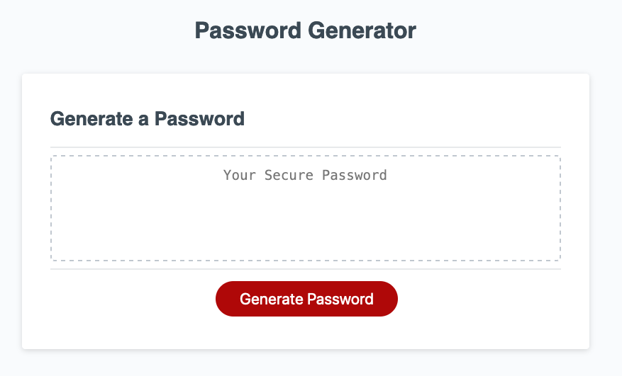
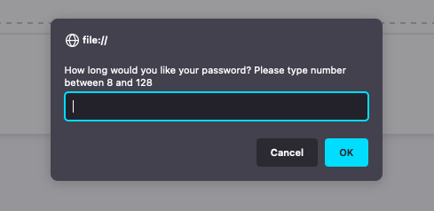
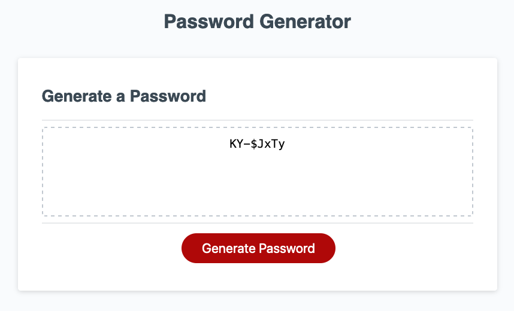

# Password-Generator

## Description

I was given the HTML and CSS files for this page and I developed the JavaScript to randomly generate a password based on criteria that the user chooses. Passwords are growing in specifications based on the site's security criteria, so my site can generate a password based on what the user needs. 

By developing the JavaScript from scratch, I was able to utilize what I have learned in my course as well as be resourceful in researching different functions within JavaScript that have not been taught. 

## Installation

n/a

## Usage

You can visit [my deployed site here](https://mdeluca13.github.io/Password-Generator/).

When you click on the Generate Password Button, you will be prompted with a series of criteria you would like to set for your password. You type in your selections based on the prompted question and then the password will be generated based on your criteria. 

## Credits

Original Code supplied by CARL-VIRT-FSF-PT-01-2023-U-LOLC GitLab Repository.

## License

The License used was the [MIT License](https://choosealicense.com/licenses/mit/). Also found in repository under LICENSE.